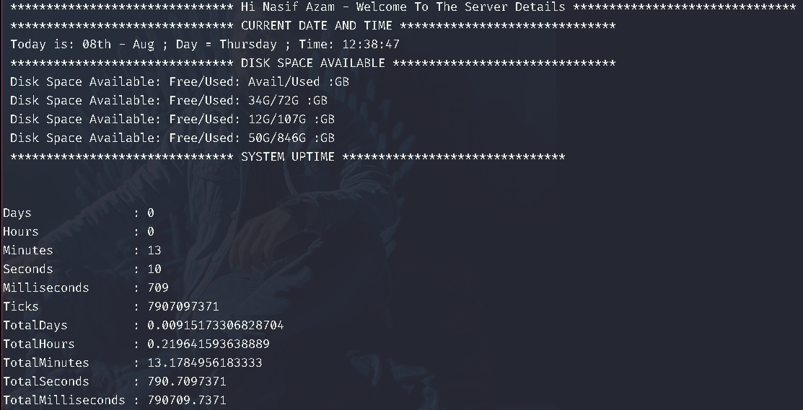
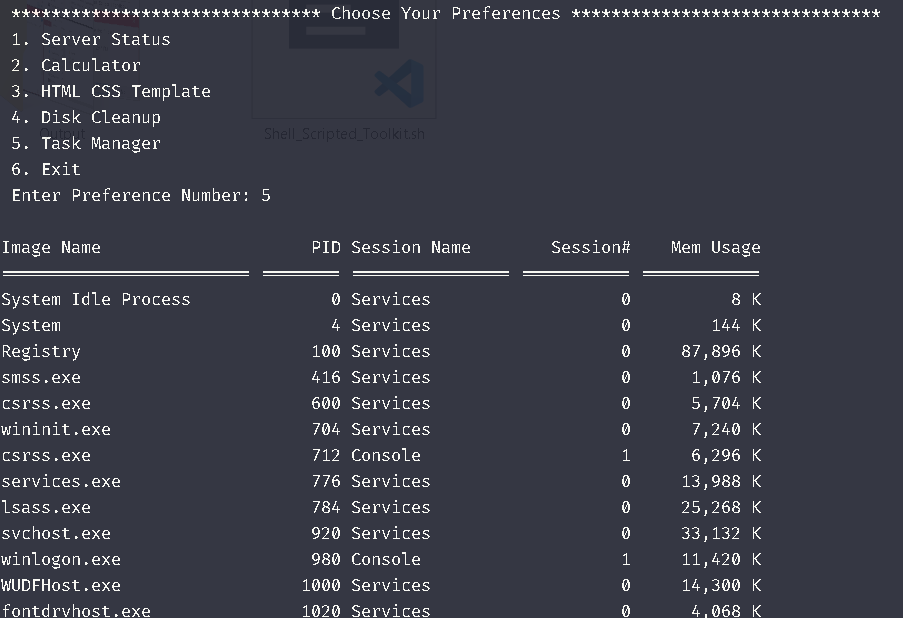

<h1 align="center">Shell Scripted Toolkit</h1>

The "Shell Scripted Toolkit" project aims to revolutionize software development and system administration within Unix-like environments by offering a comprehensive suite of shell scripts. These scripts will address common tasks encountered by developers and system administrators, including registration, login, HTML/CSS/JS template generation, a general-purpose calculator, task manager, and disk cleaning utilities. By providing these tools, the project seeks to enhance productivity, streamline processes, and promote the use of shell scripting as a valuable skill set. It arises from the growing need for efficient automation tools in software development and system administration. The "Shell Scripted Toolkit" project addresses the lack of readily available, comprehensive tools for automating common tasks in Unix-like environments. While there are existing solutions for specific tasks, such as template generation or disk cleaning, they often lack integration or fail to encompass all necessary functionalities.

## Usages
- Software Development
- System Administration
- Education and Learning 

## Implementation

  
   
  <em>Figure 1: Sign Up Page</em>

  
   
  <em>Figure 2: Log In Page</em>

  
   
  <em>Figure 3: Server Status</em>

  
   
  <em>Figure 4: General Purpose Calculator</em>

  
   
  <em>Figure 5: Website Template Maker</em>

  
   
  <em>Figure 6: Automatically Open The Template</em>

  
   
  <em>Figure 7: Disk Cleanup</em>

  
   
  <em>Figure 8: Automatically Open The Temp Files Folders</em>

  
   
  <em>Figure 9: Move All Unnecessary Files Into Useless Directory</em>

  
   
  <em>Figure 10: Task Manager</em>

  
   
  <em>Figure 11: Find A Task</em>

  
   
  <em>Figure 12: Killed The Task</em>

